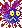

#      Swat The Flies      

> This project was built as an entry requirement for acceptance to attend Hack Reactor.

## Technologies
* HTML5
* HTML5 Canvas
* Javascript
* CSS
  

## Notes
First version is in pinTheFly folder.  The current published version has some CSS changes and minor improvements.
